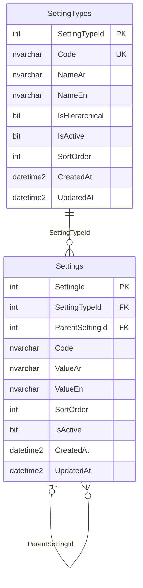

# Settings schema (SQL Server)

The active customer POS database is `POS`. Migration 001 created the tables and migration 002 removed configurable icon fields while preserving existing setting data. Text columns use `nvarchar`; timestamps are UTC `datetime2(3)`.

`SettingTypes` uses an identity `SettingTypeId` primary key. `Code nvarchar(50)` is required and unique. `NameAr` and `NameEn` are required `nvarchar(150)`. `IsHierarchical` defaults to false, `IsActive` to true, and `SortOrder` to zero with a nonnegative check. UTC creation/update timestamps use `datetime2(3)`. There is no configurable icon column.

`Settings` uses identity `SettingId`; `SettingTypeId` is required and `ParentSettingId` is nullable. `Code nvarchar(50)` remains nullable for compatibility with the version-1 schema and preserved legacy data, but new API-created rows receive a backend-generated stable code `ST-{SettingId padded to six digits}`. A deterministic suffix is only used if a preserved code already occupies the base value. `ValueAr` and `ValueEn` are required `nvarchar(200)`. `SortOrder` is a nonnegative integer; the backend assigns the next sibling/root position. `IsActive` defaults true. UTC timestamps use `datetime2(3)`. Code and sort order are not accepted as writable API fields. There is no configurable icon column.

Keys and integrity: `PK_SettingTypes` and `PK_Settings` are primary keys. `UQ_SettingTypes_Code` enforces stable unique type codes. `FK_Settings_SettingTypes` links every row to one type. `UQ_Settings_Id_Type` supports composite self-FK `FK_Settings_ParentSameType(ParentSettingId,SettingTypeId)`, which enforces that a parent belongs to the same type. `CK_Settings_NotOwnParent` rejects direct self-parenting. `CK_Settings_SortOrder` and `CK_SettingTypes_SortOrder` reject negative order values. Foreign keys do not cascade delete. The backend rejects parent values for flat types and checks longer cycles on reparenting.

Indexes: `IX_Settings_SettingTypeId` supports type lists; `IX_Settings_ParentSettingId` supports child lookups; `IX_Settings_Type_Parent` supports per-type sibling/root scans and safe sort allocation; filtered unique `UX_Settings_Type_Code(SettingTypeId,Code) WHERE Code IS NOT NULL` protects populated codes while allowing legacy nulls. The unique type-code constraint supports type lookup. No standalone active-state index is needed for these small reference lists.

Only three reference types are seeded: `UNIT` (flat), `ITEM_CATEGORY` (hierarchical), and `LOCATION` (hierarchical). No setting values are seeded. Migration 002 backfilled the existing missing code as `ST-000008` for the existing Gram row without changing its values or `SortOrder=0`.
