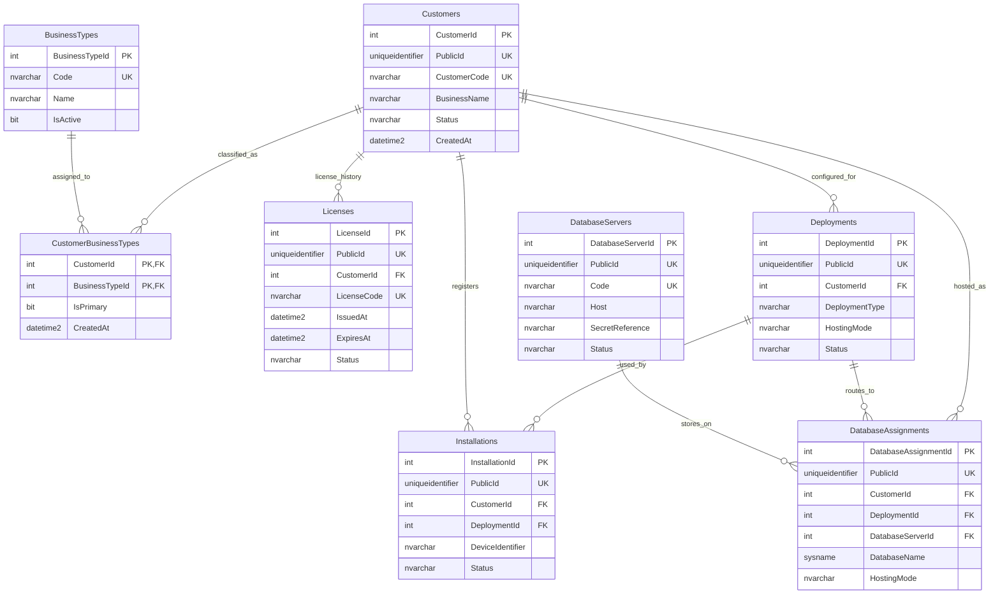

# Management ERD

`CustomerBusinessTypes` uses `(CustomerId, BusinessTypeId)` as its primary key. A filtered unique index permits at most one primary assignment per customer. `Installations` references `(DeploymentId, CustomerId)` together so it cannot point to another customer's deployment. `DatabaseAssignments` includes the constrained online deployment type and hosting mode in a composite foreign key; this makes local deployments ineligible for online assignments and keeps the assignment mode consistent with its deployment.

All foreign keys use `NO ACTION` deletion behavior. Management history is preserved unless an operator explicitly removes dependent records in a deliberate maintenance operation.
